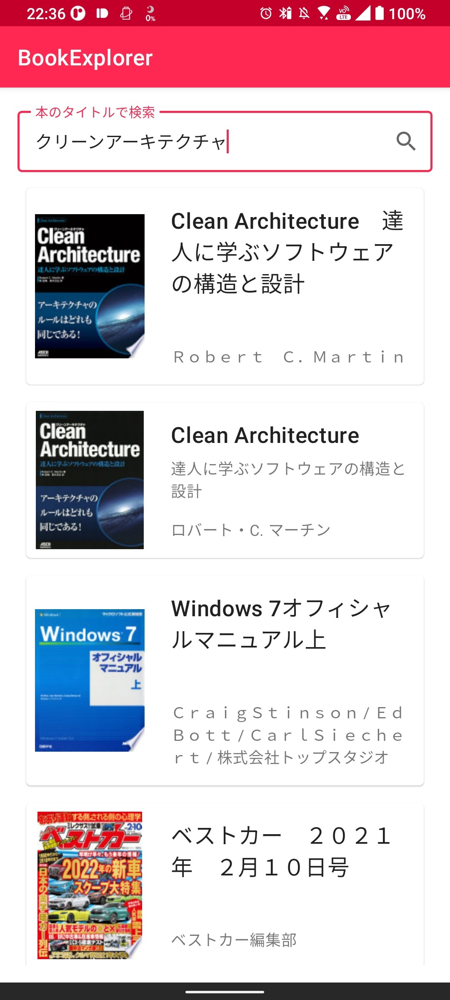

# Book Explorer

## スクリーンショット

|  |  |
| ------------------------------------------------------------ | -------------------------- |

## 概要

このアプリは設計を`MVVM + Repository`パターンを利用した、書籍の検索ができるアプリです。
以下の機能があります。

* アプリを起動直後、アプリを説明するダイアログを表示する
* 上部のEditTextから書籍を検索できる
* 書籍を一覧表示できる
* リストを選択してGoogle Booksにブラウザに遷移できる

## 設計について

#3 を参照してください

## ビルド方法

1. このプロジェクトをcloneします
2. Android Studioでcloneしたプロジェクトを開きます
3. 「Run」で動きます

